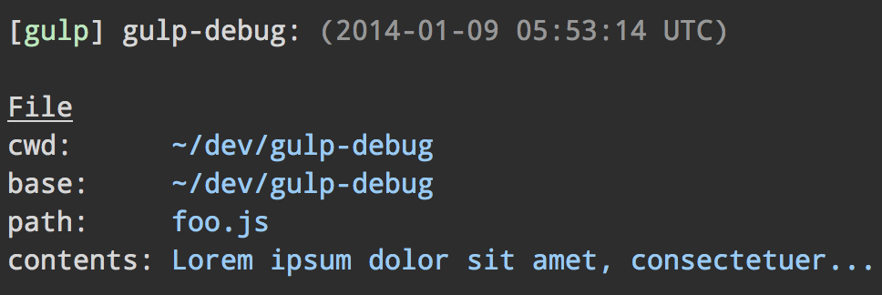

# gulp-debug

> Debug [Vinyl](https://github.com/gulpjs/vinyl) file streams to see what files are run through your Gulp pipeline



## Install

```sh
npm install --save-dev gulp-debug
```

## Usage

```js
import gulp from 'gulp';
import debug from 'gulp-debug';

export default () => (
	gulp.src('foo.js')
		.pipe(debug({title: 'unicorn:'}))
		.pipe(gulp.dest('dist'))
);
```

## API

### debug(options?)

#### options

Type: `object`

##### title

Type: `string`\
Default: `'gulp-debug:'`

Give it a custom title so it's possible to distinguish the output of multiple instances logging at once.

##### minimal

Type: `boolean`\
Default: `true`

By default only relative paths are shown. Turn off minimal mode to also show `cwd`, `base`, `path`.

The [`stat` property](https://nodejs.org/api/fs.html#fs_class_fs_stats) will be shown when you run gulp in verbose mode: `gulp --verbose`.

##### showFiles

Type: `boolean`\
Default: `true`

Print filenames.

##### showCount

Type: `boolean`\
Default: `true`

Print the file count.

##### logger(message)

Type: `Function`\
Default: `console.log`

Provide your own logging utility.

The message is passed as a string in the first argument. Note that [ANSI colors](https://github.com/chalk/chalk) may be used in the message.
